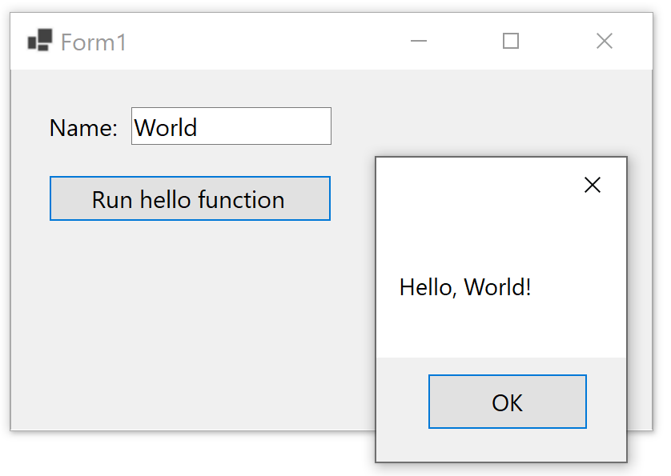

# Run Python from Windows Forms Application using IronPython

In this example you can see how to pass parameter from Windows Forms UI to a Python function using IronPython.

Here's the step by step guide:

1. Create a Windows Forms application.
2. Install [IronPython](https://www.nuget.org/packages/IronPython) nuget package.
3. Create a Code.Py file in your project, set the Copy to output directory to "Copy Alwys", and use the following content:
 
       def hello(name):
           result = 'Hello, {}!'.format(name)
           return(result)

4. Add `using IronPython.Hosting;` statement to the using statements.
5. Drop a `TextBox` on the form (textBox1)
6. Drop a `Button` on the form (button1)
7. Double click on button and add the following code for the click handler:

       private void button1_Click(object sender, EventArgs e)
       {
           var engine = Python.CreateEngine();
           var scope = engine.CreateScope();

           //You can also load script from file
           var source = engine.CreateScriptSourceFromFile(
               Path.Combine(Application.StartupPath, "Code.py"));

           //You can load from string
           //var source = engine.CreateScriptSourceFromString(
           //    "def hello(name):" + "\n" +
           //    "    result = 'Hello, {}!'.format(name)" + "\n" +
           //    "    return(result)",
           //    Microsoft.Scripting.SourceCodeKind.Statements);

           var compiled = source.Compile();
           compiled.Execute(scope);
           dynamic hello = scope.GetVariable("hello");
           var result = hello(textBox1.Text);
           MessageBox.Show((string)result);
       }
6. Press F5 to Run the application, enter a text, and click on the button. The function will run and you will see a message box saying hello:
 